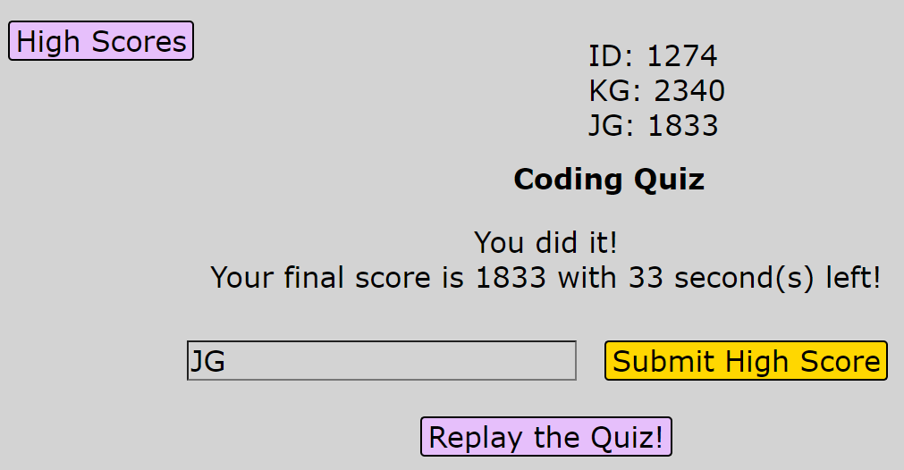

# Timed Coding Quiz

The timed coding quiz was created to test a user's knowledge of coding.

## Description

The timed coding quiz tests users' knowledge of HTML, CSS, and JavaScript using multiple choice questions. For every incorrect question, ten seconds is removed from the one minute timer. For every correct question, thirteen points are added to the user's score. Once the user has either run out of time or has completed the quiz, they can input their scores into the 'High Scores' tab. On refresh, the scores will remain through local storage.

## Technologies Used

- HTML
- CSS
- JavaScript
- Web API (DOM Manipulation)

## Usage and Website

[Timed Coding Quiz](https://kirstgonz.github.io/coding-quiz/) will put a user's knowledge of HTML, CSS, and JS to the test. With one minute and five questions, 

- https://kirstgonz.github.io/coding-quiz/

Users click 'Start' to begin the quiz, and the first question pops up.

If a user chooses an incorrect answer choice, it becomes red and says 'wrong!' at the bottom of the screen.

When the user finishes the quiz (or they run out of time as in this screenshot), they can input their initials to save to local storage.

When the 'High Scores' button is clicked, the initials submitted and ssaved to local storage are displayed. The scores persist through page reload as well as reopening.

Below is a screenshot of some code that collects a user's input for initials on a click event listener (line 159), accesses local storage (line 167), and updates the high scores (line 172). 

## Credits

Made by [Kirstyn Gonzalez](https://github.com/kirstgonz)

## License

[https://choosealicense.com/](https://choosealicense.com/).